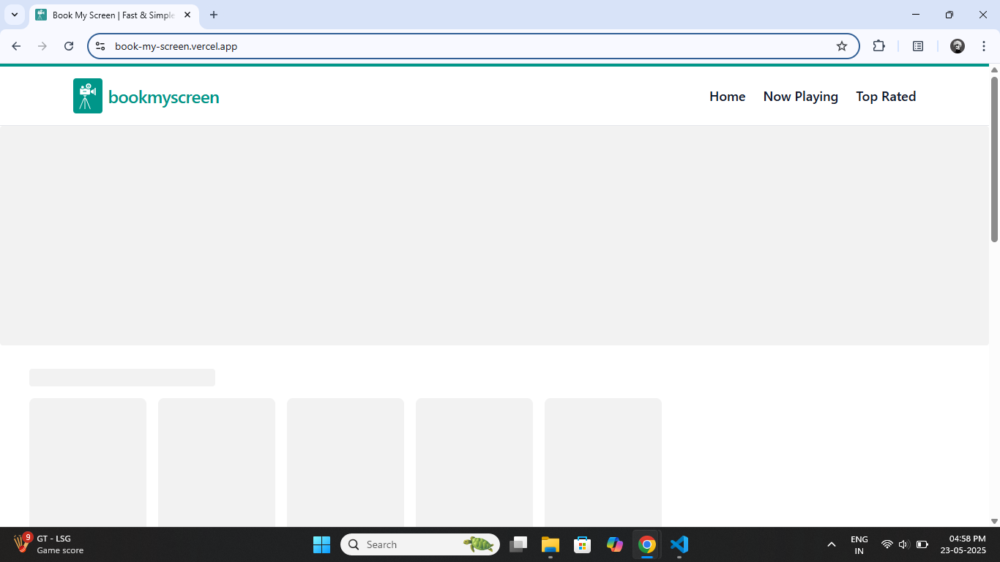
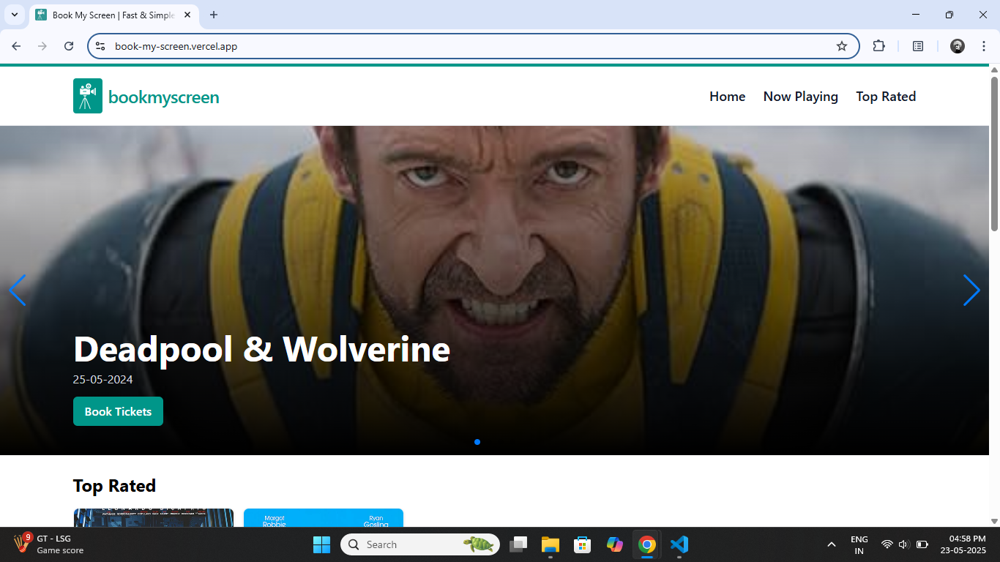
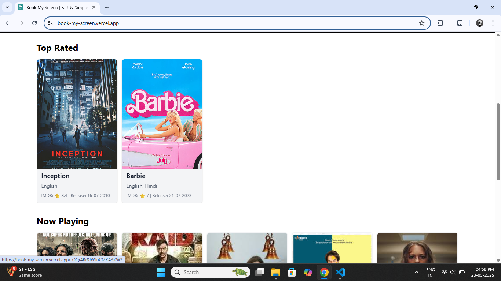
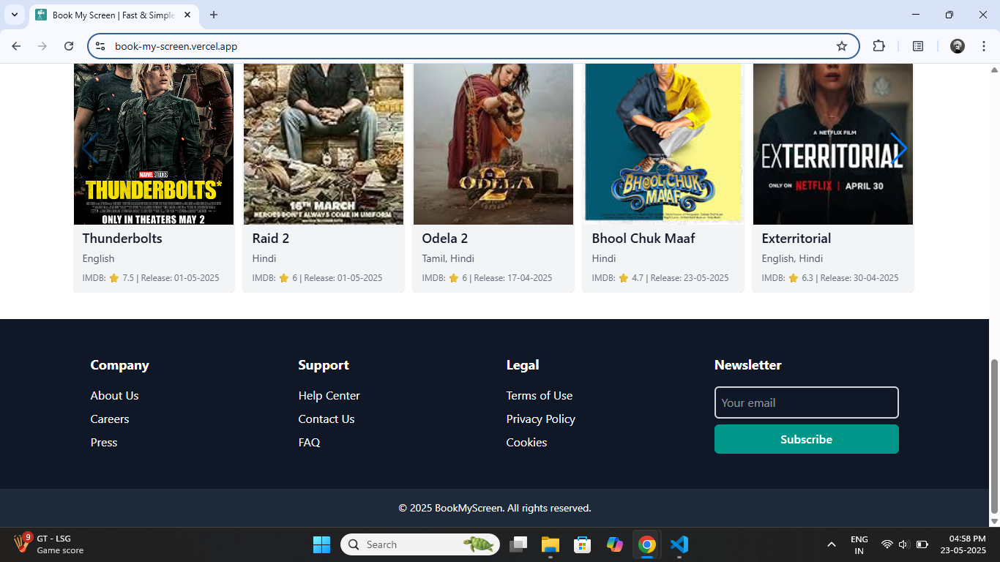
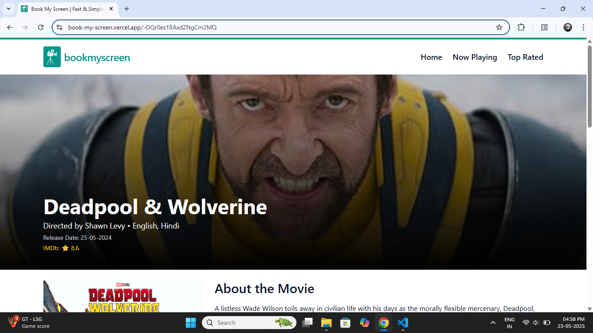
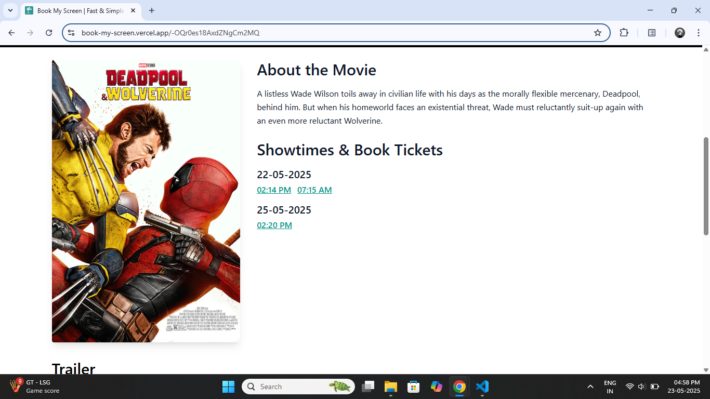
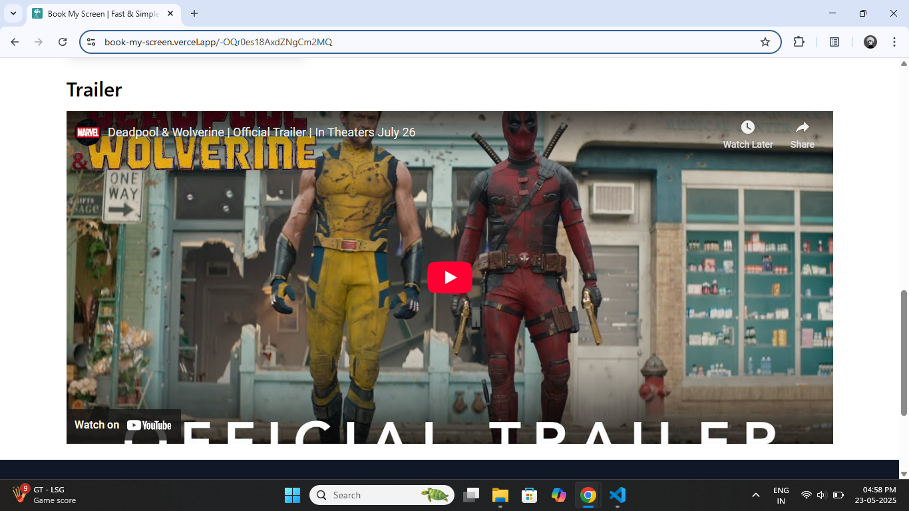
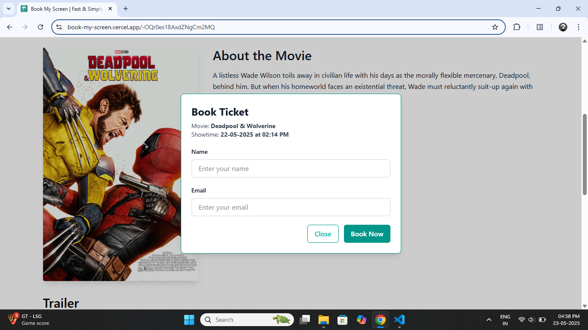
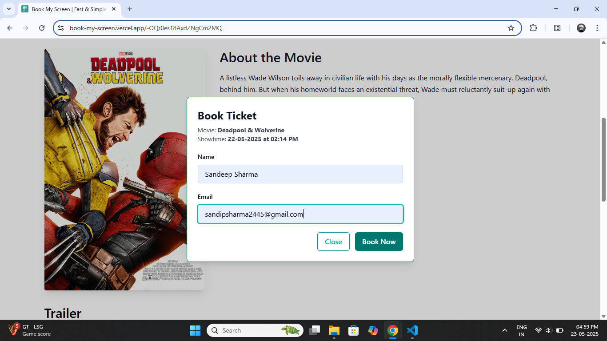
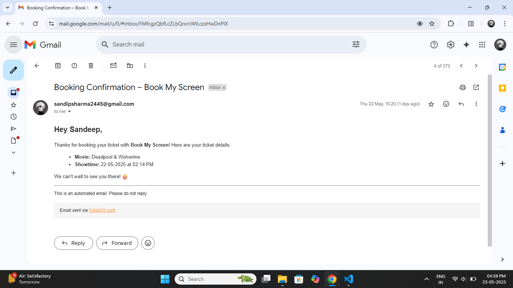

# Book My Screen

This is the user-facing side of the Book My Screen movie ticket booking platform. It allows users to browse currently available movies by category, view movie details and showtimes, and easily book tickets without needing to sign in. The entire experience is smooth, responsive, and mobile-friendly.

[Live Preview](https://book-my-screen.vercel.app/)

## 🧰 Tech Stack

This project is built using the following tools and libraries:

* **React JS** – For building the user interface

* **Redux Toolkit** – For managing and storing the app’s data

* **React Router** – For moving between pages

* **Firebase Realtime Database** – for fetching movies and categories, and save booked ticket details

* **Tailwind CSS** – For fast and modern styling

* **Formik & Yup** – For building and validating forms easily

* **EmailJS** – To send booking confirmation emails without backend

* **SwiperJS** – For the responsive, autoplay movie carousel

## ✨ Features

* **Responsive Header** – Includes a mobile-friendly toggle menu and a clean desktop navigation bar.

* **Hero Section Carousel** – Displays featured movies using an auto-playing SwiperJS slider. If the admin adds a movie in the “hero section” category, it will appear here automatically.

* **Dynamic Movie Listing** – Movies are loaded dynamically from Firebase and shown category-wise.

* **Movie Details Page** – Each movie has its own page showing full details and available showtimes (organized by date).

* **Quick Ticket Booking** – Users can book tickets without signing in—just enter name and email.

* **Email Confirmation** – After booking, users receive a confirmation email via EmailJS.

* **Modern, Clean UI** – Styled with Tailwind CSS for a sleek, responsive user experience.

## 🔄 How to Integrate SwiperJS

`SwiperJS` is used to create the autoplaying movie slider in the hero section. Here's a complete breakdown of how it was integrated:

### 📦 Step 1: Install SwiperJS

First, install Swiper via npm:

```bash
npm install swiper
```

### 🧠 Step 2: Import Swiper Styles and Modules

In the component where the carousel is used, import the necessary CSS and modules:

```js
import 'swiper/css';
import 'swiper/css/autoplay';
import 'swiper/css/pagination';

import { Swiper, SwiperSlide } from 'swiper/react';
import { Autoplay, Pagination, Navigation } from 'swiper/modules';
```

### 🧱 Step 3: Use the <Swiper> Component

Set up the Swiper component with required props:

```js
<Swiper
    modules={[Autoplay, Pagination, Navigation]}
    navigation
    autoplay={{ delay: 3000 }}
    loop={true}
    grabCursor={true}
    pagination={{ clickable: true }}
    className="h-full"
>
    {movies.map(movie => (
        <SwiperSlide key={movie.id}>
            <HeroCard movie={movie} /> // replace this content with your data 
        </SwiperSlide>
    ))}
</Swiper>
```

### ✅ What Each Prop Does:

* **modules**: Registers the Swiper modules you want to use.

* **navigation**: Enables previous/next arrows.

* **autoplay**: Automatically changes slides after a delay.

* **loop**: Allows the carousel to repeat infinitely.

* **grabCursor**: Shows grab cursor for UX.

* **pagination**: Dots below the slider, with click navigation.

## ✉️ How to Integrate EmailJS for Sending Emails

`EmailJS` allows you to send emails directly from the client side without needing your own backend server. Here's how to set it up and use it:

### Steps followed:

* **Step 1:** Created an account on [emailjs.com](https://www.emailjs.com/)

* **Step 2:** Set up an email service and create an `email template`. Grab your `Service ID`, `Template ID`, and `Public Key` from the dashboard.

* **Step 3:** Install the EmailJS package in your project:

```bash
npm install @emailjs/browser
```

* **Step 4**: Create a utility function to send emails using `EmailJS`. Store your keys safely in `environment variables` and use them here:

```js
import emailjs from '@emailjs/browser';

/**
 * Sends an email using EmailJS service.
 * @param {Object} data - Variables for the email template.
 * Example: { email, userName, movieName, showtime }
 */
const sendEmail = (data) => {
  return emailjs.send(
    import.meta.env.VITE_EMAILJS_SERVICE_ID,
    import.meta.env.VITE_EMAILJS_TEMPLATE_ID,
    {
      ...data // Pass all template variables here
    },
    import.meta.env.VITE_EMAILJS_PUBLIC_KEY
  );
};

export default sendEmail;
```

* **Step 3**: Use `sendEmail` wherever you want to send an email in your app — like after a user books a ticket.

## 📸 Preview










